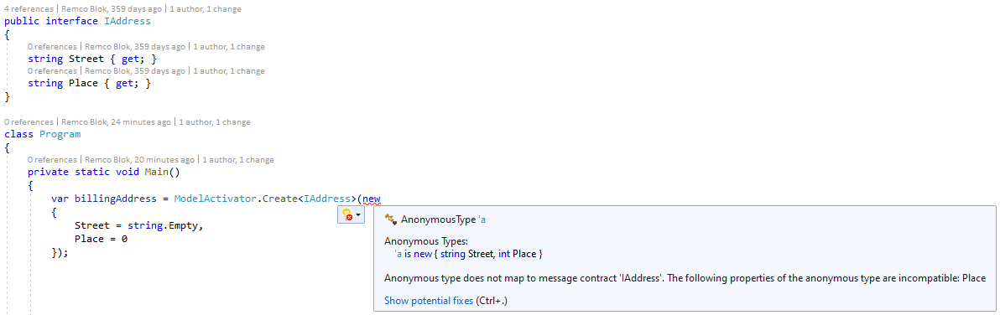
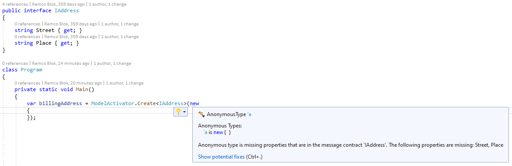
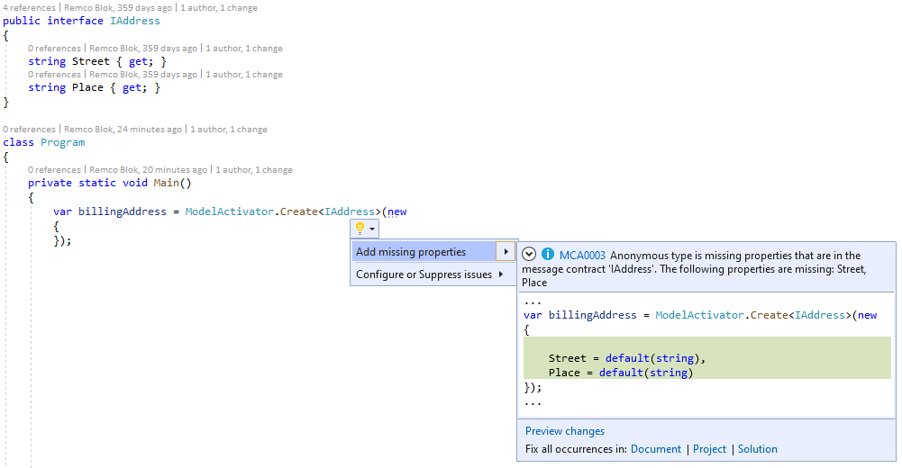

# MessageContractAnalyzer
MassTransit recommends you define messages contracts using read-only interfaces. It provides a convenience method that allows you to initialize the interface using an anonymous type without requiring the creation of a message class underneath. See https://masstransit-project.com/usage/producers.html#sending-via-interfaces

The difficulty with this approach is that the C# compiler does not give you compile time checking if the anonymous type is structurally compatible with the message contract, nor do you get Visual Studio IntelliSense when editing the anonymous type.

I have created a Roslyn analyzer that compares the anonymous type with the message contract and generates an error if they are not structurally compatible. 

In addition, if the anonymous type is missing properties from the message contract it will generate an information diagnostic result

with a code fix to add the missing properties.

The rules as well as the code fix also work with nested types and collection properties.

Where the MassTransit convenience method is an overload of the Send<> method on the ISendEndpoint and the Publish<> mehod on the IPublishEndpoint, I typically create messages first before sending or publishing them. My convenience method is a static Create<> method on a ModelActivator class where the method is annotated with an attribute named Activator. Also, I have a Create<> convenience method on a CommandActivator class that sets a property value of a base ICommand message contract, where that property is annotated with an attribute named ActivatorInitialized. See the example below:

    using System;
    using System.Collections.Generic;

    namespace Messages
    {
        public interface ICommand
        {
            [ActivatorInitialized]
            Guid CommandId { get; }
            Guid StreamId { get; }
        }

        public interface IAddress
        {
            string Street { get; }
            string Place { get; }
        }

        public interface IIdentification
        {
            string Type { get; }
            string IssuingCountry { get; }
            string Number { get; }
        }

        public interface ICreateCommand : ICommand
        {
            string Name { get; }
            IAddress BillingAddress { get; }
            IAddress DeliveryAddress { get; }
            IReadOnlyList<IIdentification> Identifications { get; }
            IReadOnlyList<IIdentification> Documents { get; }
        }

        class Program
        {
            private static void Main()
            {
                var billingAddress = ModelActivator.Create<IAddress>(new
                {
                    Street = string.Empty,
                    Place = string.Empty
                });

                var identifications = ModelActivator.Create<IReadOnlyList<IIdentification>>(new[]
                {
                    new
                    {
                        Type = string.Empty,
                        IssuingCountry = string.Empty,
                        Number = string.Empty
                    },
                    new
                    {
                        Type = string.Empty,
                        IssuingCountry = string.Empty,
                        Number = string.Empty
                    }
                });

                var command = CommandActivator.Create<ICreateCommand>(new
                {
                    StreamId = Guid.Empty,
                    Name = string.Empty,
                    BillingAddress = billingAddress,
                    DeliveryAddress = new
                    {
                        Street = string.Empty,
                        Place = string.Empty
                    },
                    Identifications = identifications,
                    Documents = new[]
                    {
                        new
                        {
                            Type = string.Empty,
                            IssuingCountry = string.Empty,
                            Number = string.Empty
                        },
                        new
                        {
                            Type = string.Empty,
                            IssuingCountry = string.Empty,
                            Number = string.Empty
                        }
                    }
                });
            }
        }
    }

The implementation of my convenience methods is similar to the MassTransit convenience method

    using MassTransit.Metadata;
    using MassTransit.Serialization;
    using Newtonsoft.Json.Linq;
    using System;

    namespace Messages
    {
        public static class ModelActivator
        {
            [Activator]
            public static T Create<T>(object values)
            {
                var jToken = JToken.FromObject(values, JsonMessageSerializer.Serializer);
                return jToken.ToObject<T>(JsonMessageSerializer.Deserializer);
            }
        }
    }

and 

    using System;
    using MassTransit.Metadata;
    using MassTransit.Serialization;
    using Newtonsoft.Json.Linq;

    namespace Messages
    {
        public static class CommandActivator
        {
            [Activator]
            public static T Create<T>(object values) where T : ICommand
            {
                var command = JObject.FromObject(values, JsonMessageSerializer.Serializer);
                command[nameof(ICommand.CommandId)] = Guid.NewGuid();
                return command.ToObject<T>(JsonMessageSerializer.Deserializer);
            }
        }
    }

Note that JsonMessageSerializer is from MassTransit. MassTransit generates a class definition at runtime for the message contract and maintains a cached mapping of message contracts to these runtime generated class definitions. JsonMessageSerializer uses these runtime generated class definitions for deserialization.
